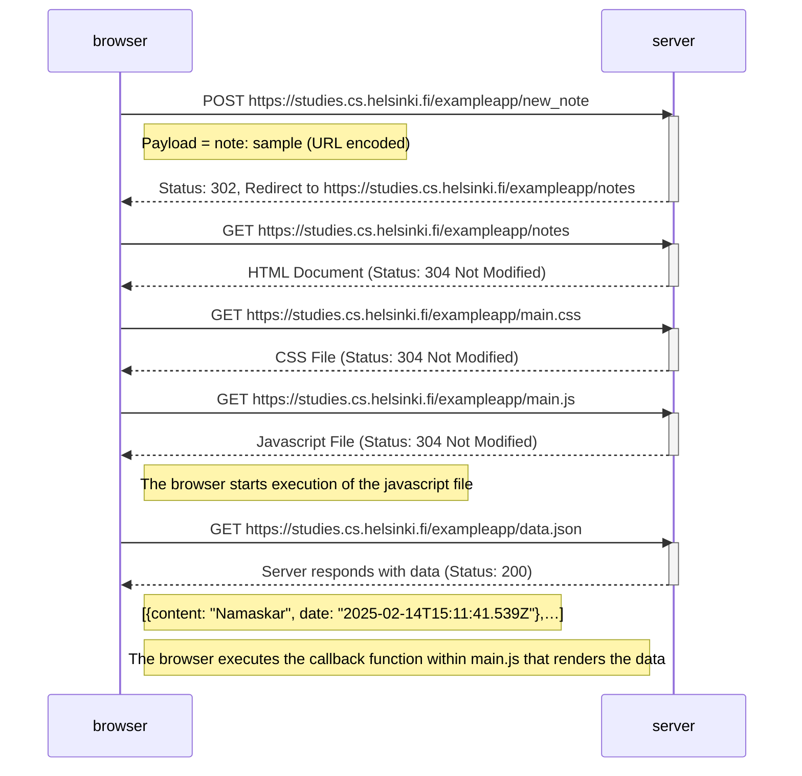

```mermaid
sequenceDiagram

participant browser
participant server

browser->>server: POST https://studies.cs.helsinki.fi/exampleapp/new_note
activate server
Note right of browser: Payload = note: sample (URL encoded)
server-->>browser: Status: 302, Redirect to https://studies.cs.helsinki.fi/exampleapp/notes
deactivate server

browser->>server: GET https://studies.cs.helsinki.fi/exampleapp/notes
activate server
server-->>browser: HTML Document (Status: 304 Not Modified)
deactivate server

browser->>server: GET https://studies.cs.helsinki.fi/exampleapp/main.css
activate server
server-->>browser: CSS File (Status: 304 Not Modified)
deactivate server

browser->>server: GET https://studies.cs.helsinki.fi/exampleapp/main.js
activate server
server-->>browser: Javascript File (Status: 304 Not Modified)
deactivate server
Note right of browser: The browser starts execution of the javascript file

browser->>server: GET https://studies.cs.helsinki.fi/exampleapp/data.json
activate server
server-->>browser: Server responds with data (Status: 200)
deactivate server
Note right of browser: [{content: "Namaskar", date: "2025-02-14T15:11:41.539Z"},…]
Note right of browser: The browser executes the callback function within main.js that renders the data
```