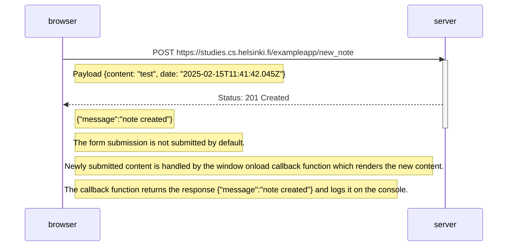

```mermaid
sequenceDiagram

participant browser
participant server

browser->>server: POST https://studies.cs.helsinki.fi/exampleapp/new_note
activate server
Note right of browser: Payload {content: "test", date: "2025-02-15T11:41:42.045Z"}
server-->>browser: Status: 201 Created
Note right of browser: {"message":"note created"}
deactivate server

Note right of browser: The form submission is not submitted by default.
Note right of browser: Newly submitted content is handled by the window onload callback function which renders the new content.
Note right of browser: The callback function returns the response {"message":"note created"} and logs it on the console.
```