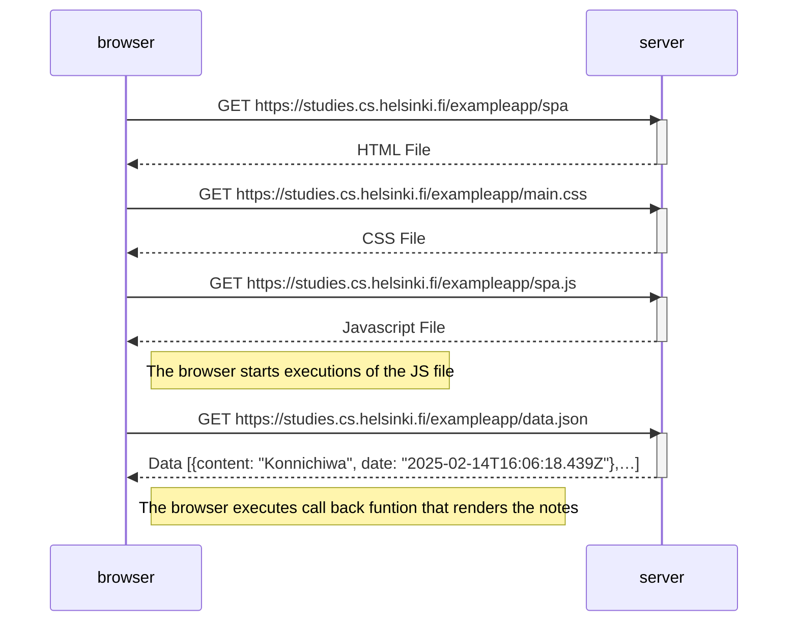

```mermaid

sequenceDiagram

participant browser
participant server

browser->>server: GET https://studies.cs.helsinki.fi/exampleapp/spa
activate server
server-->>browser: HTML File
deactivate server

browser->>server: GET https://studies.cs.helsinki.fi/exampleapp/main.css
activate server
server-->>browser: CSS File
deactivate server

browser->>server: GET https://studies.cs.helsinki.fi/exampleapp/spa.js
activate server
server-->>browser: Javascript File
deactivate server
Note right of browser: The browser starts executions of the JS file

browser->>server: GET https://studies.cs.helsinki.fi/exampleapp/data.json
activate server
server-->>browser: Data [{content: "Konnichiwa", date: "2025-02-14T16:06:18.439Z"},…]
deactivate server
Note right of browser: The browser executes call back funtion that renders the notes

```